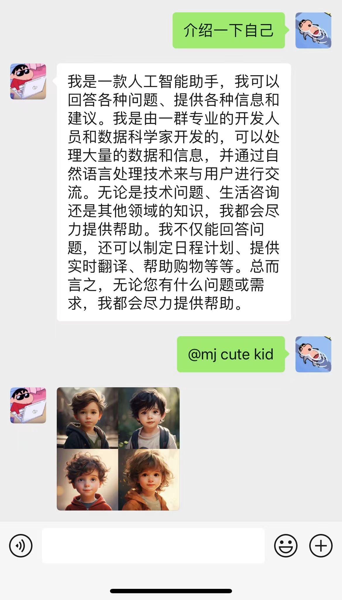

# Wechat-chatbot

微信公众号快速接入GPT，随时随地chatgpt

> chatgpt多火，我就不用多说了吧🤔
> 因为微信个人号接入容易有被封号的风险，所以选用微信公众号的方式
> 目的是体验一把ai的热潮，并且刚入门golang整好找个项目练手。

### 现有功能
- [x] 基础对话：支持gpt3.5模型，支持上下文
- [x] 图片生成：支持gpt Dell-E，Midjourney




# 快速开始
## 准备
### 1.openapi账号注册

### 2.微信公众号注册

#### 特别说明：
个人公众号是通过自动回复实现，但有5s的超时限制，超时会重试3次（通过技术实现15s的限制）如果问题复杂，或者是图片生成，特别容易超时。
所以需要用到企业认证的公众号，通过客服功能主动发消息。

### 3.访问外网的服务器
申请能科学上网的公网服务器。
* openapi接口访问需要科学上网；
* 微信公众号配置，需要提供公网地址才能将消息转发到你应用上；

<!-- ####  midjourney 配置参考： -->


## 配置

复制项目根目录下的 `config.json` 文件到你的主机自定义的目录下，比如：/home/dev/config/config.json

> cp wechat-chat/config.json /home/dev/config/config.json

然后在config.json中填入配置，以下是对默认配置的说明，可根据需要进行自定义修改（请去掉注释）：

config.json文件内容示例
```json
{
    "openapi-url": "https://api.openai.com/v1/chat/completions",
    "openapi-model": "gpt-3.5-turbo",
    "allow-all": true,
    "sync-customer": true,
    "wx-app-id": "",
    "wx-app-secret": "",
    "wx-app-token": "",
    "white-list": [""],
    "api-key": "",
    "chat-token-limit": 5,
    "midjourney-proxy": "",
    "midjourney-notify-url": ""
}
```

### 公众号配置
登录公众号后台，菜单：`设置与开发` -> `基本配置`
服务器配置url 填写模板http://{ip}/wechat-check
> ip是你的服务器地址

## 部署
### Docker部署

需要映射上面配置config.json，假设你本机的目录是 /home/dev/config/config.json

```bash
docker run -d --name wechat-chatbot \
-p 80:8080 -v /home/dev/config/config.json:/app/config.json \
--restart=always \
zhangzh520/wechat-chatbot 
```

<!-- railway？
vercel？
zeabur？
golang原生部署方式 -->


# 联系
欢迎提交PR、Issues，以及Star支持一下。
因为是刚入门的golang语言，可能有很多语言设计上的问题和缺陷，非常欢迎提意见~


